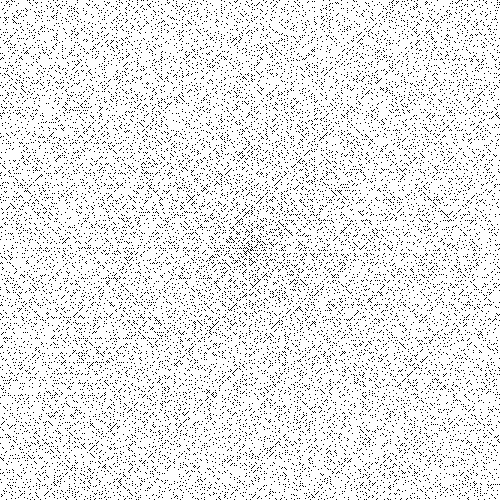

# Ulam Spiral ꩜


This program generates an ulam spiral and saves it to a `*.ppm` image file. I've used the sieve of
Eratosthenes to find all primes under a _max_ value which is calculated from the, provided by user,
width of the out-image.

<p align="center">

</p>

### Ulam spiral 🇵🇱

Ulam spiral is a graphical way of presenting the set of prime numbers. It was firstly described by a
brilliant polish mathematician [Stanisław Ulam](https://en.wikipedia.org/wiki/Stanisław_Ulam). In
order to construct ulam spiral one has to:

- write down positive integers in a shape of a square spiral
- and then mark all prime numbers

Ulam spiral shows an interesting pattern in the distribution on primes. Notice the clearly visible
horizontal and diagonal lines.

Construction of an ulam spiral (source [_Wikipedia_](https://en.wikipedia.org/wiki/Ulam_spiral)):


### Sieve of Eratosthenes 🇬🇷

This is a simple algorithm that allows to find all prime numbers up to a specified _max_ value.

The algorithm iteratively marks every
[_composite number_](https://en.wikipedia.org/wiki/Composite_number) (this is a number that is not
prime 💁‍♂️) by calculating multiples of prime numbers. It starts from the first prime number (2).

### Further reading 🔎

- [Ulam Spiral](https://en.wikipedia.org/wiki/Ulam_spiral)
- [Euler's prime generating formula](https://en.wikipedia.org/wiki/Formula_for_primes#Prime_formulas_and_polynomial_functions)
- [Sieve of Eratosthenes](https://en.wikipedia.org/wiki/Sieve_of_Eratosthenes)
- [Sieve theory](https://en.wikipedia.org/wiki/Sieve_theory)

---

## Build 🔧

```
$ cd build/
$ cmake .. -DCMAKE_BUILD_TYPE=Debug -G "Unix Makefiles"
$ make all
$ ./bin/ulam-spiral
```

### Running tests

I'm using [googletest](https://github.com/google/googletest) `release-1.10.0`. It is added as a git
submodule. In order to run tests, you have to checkout this repo with submodules. You can do it
with:

```
$ git submodule update --init --recursive
```

Alternatively, you can download all submodules during cloning:

```
$ git clone --recursive git://github.com/pniewiejski/luhnjs.git
```

```
$ cd build/
$ cmake .. -DCMAKE_BUILD_TYPE=Debug -G "Unix Makefiles"
$ make all
$ ./bin/ulam-spiral_test
```

## Code style ✍️

Code formatting was done using `clang-format`. I've created a simple bash script (`format-code.sh`)
that runs the `clang-format` command. `clang-format` config was generated using:

```
$ clang-format -style=google -dump-config > .clang-format
```

## Image file format

I'm using [Netpbm](https://en.wikipedia.org/wiki/Netpbm)'s portable bitmap format (`P1`) because
there's hardly anything simpler than that 😜.
